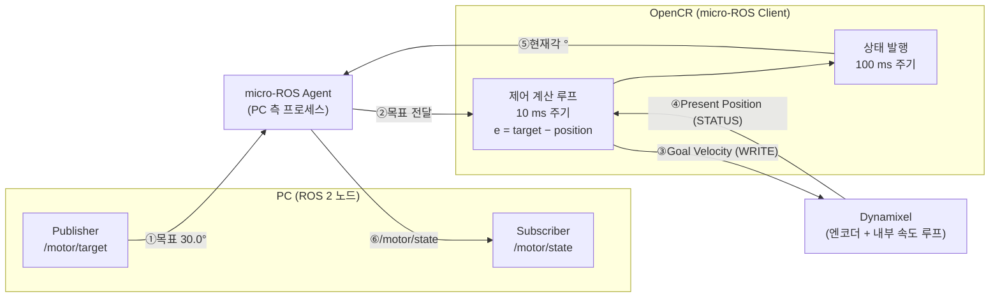

# Level 2 · 모듈 1 보고서

---

## 문제 1

### 1) 원격 수행 환경 구성


| 확인 항목 | 명령 | 결과 |
|---|---|---|
| 호스트명 | `hostname` | `pa03` |
| OS | `cat /etc/os-release` | `Ubuntu 22.04.5 LTS (Jammy Jellyfish)` |
| 아키텍처 | `uname -m` | `aarch64` |
| 원격 접속 | `who` | `pa03  pts/0  2026-09-29 19:17 (10.2.12.143)` — SSH 세션으로 접속 |
| OpenCR USB 인식 | `lsusb` | `Bus 001 Device 003: ID 0483:5740 STMicroelectronics Virtual COM Port` |
| 사용 포트 | `ls -l /dev/ttyACM*` | `crw-rw---- 1 root dialout 166, 0 /dev/ttyACM0` |

작업한 장치는 라즈베리파이 `pa03`이며, macOS 노트북에서 SSH로 원격 접속해 모든 명령을 라즈베리파이 위에서 실행했습니다.
사용한 포트는 **`/dev/ttyACM0`** 입니다. 포트의 소유 그룹이 `dialout`이고 계정이 해당 그룹에 속해 있어,
`sudo` 없이 업로더와 miniterm이 포트를 열 수 있었습니다(아래 업로드·실행 기록이 모두 일반 계정으로 수행됨).

### 2) OpenCR 펌웨어 업로드


### 3) 목표 입력과 응답 기록 (실행 A)

실행 화면
| A 시작 | A 종료 |
|---|---|
|  |  |

```A
pa03@pa03:~/pa-opencr-build$ python3 -m serial.tools.miniterm "$PORT" 115200 --eol LF -e
--- Miniterm on /dev/ttyACM0  115200,8,N,1 ---
--- Quit: Ctrl+] | Menu: Ctrl+T | Help: Ctrl+T followed by Ctrl+H ---
s 10 30 30
START: current position = 0 deg.
P SET Kp=10.0000, Ki=0.0000, Kd=0.0000, speed_limit_deg_s=30.000, angle_deg=30.000
Run timeout [s]: 60.0
target_deg:0.000        position_deg:0.000      error_deg:0.000 p_deg_s:0.000   i_deg_s:0.000   d_deg_s:0.000   pid_deg_s:0.000 speed_deg_s:0.000       u_deg_s:0.000   v_limit_deg_s:30.000    dt_ms:10.001     kp:10.0000      ki:0.0000       kd:0.0000       t_s:0.100
target_deg:0.000        position_deg:0.000      error_deg:0.000 p_deg_s:0.000   i_deg_s:0.000   d_deg_s:0.000   pid_deg_s:0.000 speed_deg_s:0.000       u_deg_s:0.000   v_limit_deg_s:30.000    dt_ms:10.000     kp:10.0000      ki:0.0000       kd:0.0000       t_s:0.200
target_deg:0.000        position_deg:0.088      error_deg:-0.088        p_deg_s:0.000   i_deg_s:0.000   d_deg_s:0.000   pid_deg_s:0.000 speed_deg_s:0.000       u_deg_s:0.000   v_limit_deg_s:30.000    dt_ms:10.001     kp:10.0000      ki:0.0000       kd:0.0000       t_s:0.300
target_deg:0.000        position_deg:0.000      error_deg:0.000 p_deg_s:0.000   i_deg_s:0.000   d_deg_s:0.000   pid_deg_s:0.000 speed_deg_s:0.000       u_deg_s:0.000   v_limit_deg_s:30.000    dt_ms:10.000     kp:10.0000      ki:0.0000       kd:0.0000       t_s:0.400
target_deg:0.000        position_deg:0.000      error_deg:0.000 p_deg_s:0.000   i_deg_s:0.000   d_deg_s:0.000   pid_deg_s:0.000 speed_deg_s:0.000       u_deg_s:0.000   v_limit_deg_s:30.000    dt_ms:10.000     kp:10.0000      ki:0.0000       kd:0.0000       t_s:0.500
target_deg:0.000        position_deg:0.000      error_deg:0.000 p_deg_s:0.000   i_deg_s:0.000   d_deg_s:0.000   pid_deg_s:0.000 speed_deg_s:0.000       u_deg_s:0.000   v_limit_deg_s:30.000    dt_ms:10.001     kp:10.0000      ki:0.0000       kd:0.0000       t_s:0.600
target_deg:0.000        position_deg:0.000      error_deg:0.000 p_deg_s:0.000   i_deg_s:0.000   d_deg_s:0.000   pid_deg_s:0.000 speed_deg_s:0.000       u_deg_s:0.000   v_limit_deg_s:30.000    dt_ms:10.000     kp:10.0000      ki:0.0000       kd:0.0000       t_s:0.700
target_deg:0.000        position_deg:0.000      error_deg:0.000 p_deg_s:0.000   i_deg_s:0.000   d_deg_s:0.000   pid_deg_s:0.000 speed_deg_s:0.000       u_deg_s:0.000   v_limit_deg_s:30.000    dt_ms:10.000     kp:10.0000      ki:0.0000       kd:0.0000       t_s:0.800
target_deg:0.000        position_deg:0.000      error_deg:0.000 p_deg_s:0.000   i_deg_s:0.000   d_deg_s:0.000   pid_deg_s:0.000 speed_deg_s:0.000       u_deg_s:0.000   v_limit_deg_s:30.000    dt_ms:10.000     kp:10.0000      ki:0.0000       kd:0.0000       t_s:0.900
target_deg:0.000        position_deg:0.000      error_deg:0.000 p_deg_s:0.000   i_deg_s:0.000   d_deg_s:0.000   pid_deg_s:0.000 speed_deg_s:0.000       u_deg_s:0.000   v_limit_deg_s:30.000    dt_ms:10.000     kp:10.0000      ki:0.0000       kd:0.0000       t_s:1.000
target_deg:0.000        position_deg:0.000      error_deg:0.000 p_deg_s:0.000   i_deg_s:0.000   d_deg_s:0.000   pid_deg_s:0.000 speed_deg_s:0.000       u_deg_s:0.000   v_limit_deg_s:30.000    dt_ms:10.000     kp:10.0000      ki:0.0000       kd:0.0000       t_s:1.100
target_deg:0.000        position_deg:0.000      error_deg:0.000 p_deg_s:0.000   i_deg_s:0.000   d_deg_s:0.000   pid_deg_s:0.000 speed_deg_s:0.000       u_deg_s:0.000   v_limit_deg_s:30.000    dt_ms:10.001     kp:10.0000      ki:0.0000       kd:0.0000       t_s:1.200
target_deg:0.000        position_deg:0.000      error_deg:0.000 p_deg_s:0.000   i_deg_s:0.000   d_deg_s:0.000   pid_deg_s:0.000 speed_deg_s:0.000       u_deg_s:0.000   v_limit_deg_s:30.000    dt_ms:10.002     kp:10.0000      ki:0.0000       kd:0.0000       t_s:1.300
target_deg:0.000        position_deg:0.000      error_deg:0.000 p_deg_s:0.000   i_deg_s:0.000   d_deg_s:0.000   pid_deg_s:0.000 speed_deg_s:0.000       u_deg_s:0.000   v_limit_deg_s:30.000    dt_ms:10.002     kp:10.0000      ki:0.0000       kd:0.0000       t_s:1.400
target_deg:0.000        position_deg:0.000      error_deg:0.000 p_deg_s:0.000   i_deg_s:0.000   d_deg_s:0.000   pid_deg_s:0.000 speed_deg_s:0.000       u_deg_s:0.000   v_limit_deg_s:30.000    dt_ms:10.001     kp:10.0000      ki:0.0000       kd:0.0000       t_s:1.500
target_deg:0.000        position_deg:0.000      error_deg:0.000 p_deg_s:0.000   i_deg_s:0.000   d_deg_s:0.000   pid_deg_s:0.000 speed_deg_s:0.000       u_deg_s:0.000   v_limit_deg_s:30.000    dt_ms:10.000     kp:10.0000      ki:0.0000       kd:0.0000       t_s:1.600
target_deg:0.000        position_deg:0.000      error_deg:0.000 p_deg_s:0.000   i_deg_s:0.000   d_deg_s:0.000   pid_deg_s:0.000 speed_deg_s:0.000       u_deg_s:0.000   v_limit_deg_s:30.000    dt_ms:10.002     kp:10.0000      ki:0.0000       kd:0.0000       t_s:1.700
target_deg:0.000        position_deg:0.000      error_deg:0.000 p_deg_s:0.000   i_deg_s:0.000   d_deg_s:0.000   pid_deg_s:0.000 speed_deg_s:0.000       u_deg_s:0.000   v_limit_deg_s:30.000    dt_ms:10.002     kp:10.0000      ki:0.0000       kd:0.0000       t_s:1.800
target_deg:0.000        position_deg:0.000      error_deg:0.000 p_deg_s:0.000   i_deg_s:0.000   d_deg_s:0.000   pid_deg_s:0.000 speed_deg_s:0.000       u_deg_s:0.000   v_limit_deg_s:30.000    dt_ms:10.002     kp:10.0000      ki:0.0000       kd:0.0000       t_s:1.900
target_deg:30.000       position_deg:0.000      error_deg:30.000        p_deg_s:300.000 i_deg_s:0.000   d_deg_s:0.000   pid_deg_s:300.000       speed_deg_s:0.000       u_deg_s:28.854  v_limit_deg_s:30.000     dt_ms:10.001    kp:10.0000      ki:0.0000       kd:0.0000       t_s:2.000
target_deg:30.000       position_deg:0.264      error_deg:29.736        p_deg_s:297.363 i_deg_s:0.000   d_deg_s:0.000   pid_deg_s:297.363       speed_deg_s:2.748       u_deg_s:28.854  v_limit_deg_s:30.000     dt_ms:10.001    kp:10.0000      ki:0.0000       kd:0.0000       t_s:2.100
target_deg:30.000       position_deg:1.670      error_deg:28.330        p_deg_s:283.301 i_deg_s:0.000   d_deg_s:0.000   pid_deg_s:283.301       speed_deg_s:15.114      u_deg_s:28.854  v_limit_deg_s:30.000     dt_ms:10.002    kp:10.0000      ki:0.0000       kd:0.0000       t_s:2.200
target_deg:30.000       position_deg:3.955      error_deg:26.045        p_deg_s:260.449 i_deg_s:0.000   d_deg_s:0.000   pid_deg_s:260.449       speed_deg_s:24.732      u_deg_s:28.854  v_limit_deg_s:30.000     dt_ms:10.002    kp:10.0000      ki:0.0000       kd:0.0000       t_s:2.300
target_deg:30.000       position_deg:6.855      error_deg:23.145        p_deg_s:231.445 i_deg_s:0.000   d_deg_s:0.000   pid_deg_s:231.445       speed_deg_s:27.480      u_deg_s:28.854  v_limit_deg_s:30.000     dt_ms:10.001    kp:10.0000      ki:0.0000       kd:0.0000       t_s:2.400
target_deg:30.000       position_deg:9.668      error_deg:20.332        p_deg_s:203.320 i_deg_s:0.000   d_deg_s:0.000   pid_deg_s:203.320       speed_deg_s:27.480      u_deg_s:28.854  v_limit_deg_s:30.000     dt_ms:10.001    kp:10.0000      ki:0.0000       kd:0.0000       t_s:2.500
target_deg:30.000       position_deg:12.568     error_deg:17.432        p_deg_s:174.316 i_deg_s:0.000   d_deg_s:0.000   pid_deg_s:174.316       speed_deg_s:28.854      u_deg_s:28.854  v_limit_deg_s:30.000     dt_ms:10.003    kp:10.0000      ki:0.0000       kd:0.0000       t_s:2.600
target_deg:30.000       position_deg:15.381     error_deg:14.619        p_deg_s:146.191 i_deg_s:0.000   d_deg_s:0.000   pid_deg_s:146.191       speed_deg_s:28.854      u_deg_s:28.854  v_limit_deg_s:30.000     dt_ms:10.000    kp:10.0000      ki:0.0000       kd:0.0000       t_s:2.700
target_deg:30.000       position_deg:18.369     error_deg:11.631        p_deg_s:116.309 i_deg_s:0.000   d_deg_s:0.000   pid_deg_s:116.309       speed_deg_s:27.480      u_deg_s:28.854  v_limit_deg_s:30.000     dt_ms:10.001    kp:10.0000      ki:0.0000       kd:0.0000       t_s:2.800
target_deg:30.000       position_deg:21.270     error_deg:8.730 p_deg_s:87.305  i_deg_s:0.000   d_deg_s:0.000   pid_deg_s:87.305        speed_deg_s:28.854      u_deg_s:28.854  v_limit_deg_s:30.000    dt_ms:10.002     kp:10.0000      ki:0.0000       kd:0.0000       t_s:2.900
target_deg:30.000       position_deg:24.258     error_deg:5.742 p_deg_s:57.422  i_deg_s:0.000   d_deg_s:0.000   pid_deg_s:57.422        speed_deg_s:28.854      u_deg_s:28.854  v_limit_deg_s:30.000    dt_ms:10.002     kp:10.0000      ki:0.0000       kd:0.0000       t_s:3.000
target_deg:30.000       position_deg:27.070     error_deg:2.930 p_deg_s:29.297  i_deg_s:0.000   d_deg_s:0.000   pid_deg_s:29.297        speed_deg_s:27.480      u_deg_s:28.854  v_limit_deg_s:30.000    dt_ms:10.000     kp:10.0000      ki:0.0000       kd:0.0000       t_s:3.100
target_deg:30.000       position_deg:29.795     error_deg:0.205 p_deg_s:2.051   i_deg_s:0.000   d_deg_s:0.000   pid_deg_s:2.051 speed_deg_s:24.732      u_deg_s:1.374   v_limit_deg_s:30.000    dt_ms:10.001     kp:10.0000      ki:0.0000       kd:0.0000       t_s:3.200
target_deg:30.000       position_deg:31.641     error_deg:-1.641        p_deg_s:-16.406 i_deg_s:0.000   d_deg_s:0.000   pid_deg_s:-16.406       speed_deg_s:15.114      u_deg_s:-16.488 v_limit_deg_s:30.000     dt_ms:10.001    kp:10.0000      ki:0.0000       kd:0.0000       t_s:3.300
target_deg:30.000       position_deg:32.256     error_deg:-2.256        p_deg_s:-22.559 i_deg_s:0.000   d_deg_s:0.000   pid_deg_s:-22.559       speed_deg_s:2.748       u_deg_s:-21.984 v_limit_deg_s:30.000     dt_ms:10.001    kp:10.0000      ki:0.0000       kd:0.0000       t_s:3.400
target_deg:30.000       position_deg:32.168     error_deg:-2.168        p_deg_s:-21.680 i_deg_s:0.000   d_deg_s:0.000   pid_deg_s:-21.680       speed_deg_s:0.000       u_deg_s:-21.984 v_limit_deg_s:30.000     dt_ms:10.001    kp:10.0000      ki:0.0000       kd:0.0000       t_s:3.500
target_deg:30.000       position_deg:30.762     error_deg:-0.762        p_deg_s:-7.617  i_deg_s:0.000   d_deg_s:0.000   pid_deg_s:-7.617        speed_deg_s:-13.740     u_deg_s:-8.244  v_limit_deg_s:30.000     dt_ms:10.002    kp:10.0000      ki:0.0000       kd:0.0000       t_s:3.600
target_deg:30.000       position_deg:30.234     error_deg:-0.234        p_deg_s:-2.344  i_deg_s:0.000   d_deg_s:0.000   pid_deg_s:-2.344        speed_deg_s:-1.374      u_deg_s:-2.748  v_limit_deg_s:30.000     dt_ms:10.002    kp:10.0000      ki:0.0000       kd:0.0000       t_s:3.700
target_deg:30.000       position_deg:30.059     error_deg:-0.059        p_deg_s:0.000   i_deg_s:0.000   d_deg_s:0.000   pid_deg_s:0.000 speed_deg_s:0.000       u_deg_s:0.000   v_limit_deg_s:30.000    dt_ms:10.000     kp:10.0000      ki:0.0000       kd:0.0000       t_s:3.800
target_deg:30.000       position_deg:30.059     error_deg:-0.059        p_deg_s:0.000   i_deg_s:0.000   d_deg_s:0.000   pid_deg_s:0.000 speed_deg_s:0.000       u_deg_s:0.000   v_limit_deg_s:30.000    dt_ms:10.000     kp:10.0000      ki:0.0000       kd:0.0000       t_s:3.900
target_deg:30.000       position_deg:30.059     error_deg:-0.059        p_deg_s:0.000   i_deg_s:0.000   d_deg_s:0.000   pid_deg_s:0.000 speed_deg_s:0.000       u_deg_s:0.000   v_limit_deg_s:30.000    dt_ms:10.002     kp:10.0000      ki:0.0000       kd:0.0000       t_s:4.000
target_deg:30.000       position_deg:30.059     error_deg:-0.059        p_deg_s:0.000   i_deg_s:0.000   d_deg_s:0.000   pid_deg_s:0.000 speed_deg_s:0.000       u_deg_s:0.000   v_limit_deg_s:30.000    dt_ms:10.001     kp:10.0000      ki:0.0000       kd:0.0000       t_s:4.100
target_deg:30.000       position_deg:30.059     error_deg:-0.059        p_deg_s:0.000   i_deg_s:0.000   d_deg_s:0.000   pid_deg_s:0.000 speed_deg_s:0.000       u_deg_s:0.000   v_limit_deg_s:30.000    dt_ms:10.000     kp:10.0000      ki:0.0000       kd:0.0000       t_s:4.200
target_deg:30.000       position_deg:30.059     error_deg:-0.059        p_deg_s:0.000   i_deg_s:0.000   d_deg_s:0.000   pid_deg_s:0.000 speed_deg_s:0.000       u_deg_s:0.000   v_limit_deg_s:30.000    dt_ms:10.001     kp:10.0000      ki:0.0000       kd:0.0000       t_s:4.300
target_deg:30.000       position_deg:30.059     error_deg:-0.059        p_deg_s:0.000   i_deg_s:0.000   d_deg_s:0.000   pid_deg_s:0.000 speed_deg_s:0.000       u_deg_s:0.000   v_limit_deg_s:30.000    dt_ms:10.002     kp:10.0000      ki:0.0000       kd:0.0000       t_s:4.400
target_deg:30.000       position_deg:30.059     error_deg:-0.059        p_deg_s:0.000   i_deg_s:0.000   d_deg_s:0.000   pid_deg_s:0.000 speed_deg_s:0.000       u_deg_s:0.000   v_limit_deg_s:30.000    dt_ms:10.001     kp:10.0000      ki:0.0000       kd:0.0000       t_s:4.500
xSTOP: user
```

입력한 명령은 `s 10 30 30` 한 줄이며, 펌웨어가 아래와 같이 설정을 되돌려 출력했습니다.

```
P SET Kp=10.0000 speed_limit_deg_s=30.000, angle_deg=30.000
```

`t_s = 0.1 ~ 1.9 s` 구간은 `target_deg = 0`인 대기 구간이고, `t_s = 2.000 s`에 목표가 `+30.0°`로 변경되었습니다.

주요 시점만 옮기면 다음과 같습니다.

| `t_s` (s) | `target_deg` (°) | `position_deg` (°) | `error_deg` (°) | `p_deg_s` (°/s) | `u_deg_s` (°/s) | `speed_deg_s` (°/s) |
|---:|---:|---:|---:|---:|---:|---:|
| 1.900 | 0.000 | 0.000 | 0.000 | 0.000 | 0.000 | 0.000 |
| **2.000** | **30.000** | 0.000 | 30.000 | 300.000 | 28.854 | 0.000 |
| 2.200 | 30.000 | 1.670 | 28.330 | 283.301 | 28.854 | 15.114 |
| 2.500 | 30.000 | 9.668 | 20.332 | 203.320 | 28.854 | 27.480 |
| 2.800 | 30.000 | 18.369 | 11.631 | 116.309 | 28.854 | 27.480 |
| 3.100 | 30.000 | 27.070 | 2.930 | 29.297 | 28.854 | 27.480 |
| 3.200 | 30.000 | 29.795 | 0.205 | 2.051 | 1.374 | 24.732 |
| 3.400 | 30.000 | 32.256 | −2.256 | −22.559 | −21.984 | 2.748 |
| 3.600 | 30.000 | 30.762 | −0.762 | −7.617 | −8.244 | −13.740 |
| 3.800 | 30.000 | 30.059 | −0.059 | 0.000 | 0.000 | 0.000 |
| 4.500 | 30.000 | 30.059 | −0.059 | 0.000 | 0.000 | 0.000 |

정지 확인: `t_s = 3.800 s`부터 기록 마지막 행(`t_s = 4.500 s`)까지 8행 연속으로
`position_deg = 30.059`(변화 없음), `speed_deg_s = 0.000`,
`u_deg_s = 0.000`이 유지되었습니다.

이후 `x`를 입력해 `STOP: user`로 실행을 종료했으며, 이는 `results/A_finish.png` 마지막 줄에서 확인됩니다.

### 4) 결과 설명

#### 설정 요약

| 항목 | 값 |
|---|---|
| 예제 이름 | `opencr_position_p` |
| 모터 모델 | Dynamixel XM430-W210 |
| 모터 ID | 2 |
| 게인 | Kp = 10.0|
| 목표각 | +30.0 ° (시작 자세 대비 상대각) |
| 속도 상한 | 30.0 °/s |
| 제어 주기 | 10 ms |
| 실행 타임아웃 | 60.0 s |

#### 값의 이름과 단위 구분

| 분류 | 로그 필드 | 단위 |
|---|---|---|
| 목표값 | `target_deg` | ° (도) |
| 측정값 | `position_deg` | ° |
| 측정값 | `speed_deg_s` | °/s |
| 계산값 | `error_deg` | ° |
| 제어 항 | `p_deg_s` / `i_deg_s` / `d_deg_s` | °/s |
| 제어 출력(포화 전) | `pid_deg_s` | °/s |
| 제어 출력(실제 전송) | `u_deg_s` | °/s |
| 설정값 | `v_limit_deg_s` | °/s |
| 설정값 | `kp` / `ki` / `kd` | s⁻¹ / s⁻² / (무차원) |
| 시간 | `dt_ms` / `t_s` | ms / s |


#### 목표와 가까워 졌는 지

목표를 +30°로 바꾼 직후 속도 명령은 28.854 °/s로 설정되었고, 실제 속도는 0 → 2.748 → 15.114 °/s로 점차 증가했습니다. 약 1.2초 만에 목표 부근에 도달했으며, `error_deg`가 30.000 → 2.930 → 0.205로 줄면서 `u_deg_s`도 28.854 → 1.374로 함께 작아지다가 32.256°까지 2.3° 지나친 뒤 되돌아왔습니다. 최종적으로 30.059°에서 멈춰 목표에 도달했고, 이후 `u_deg_s = 0`으로 정지 상태를 유지했습니다.

---

## 문제 2

### 오차 계산 표

오차 정의: **`error_deg` = `target_deg` − `position_deg`**

| 시점 구분 | `t_s` (s) | 목표 변경 후 경과 (s) | 목표각 (°) | 현재각 (°) | 오차 (°) | 계산 |
|---|---:|---:|---:|---:|---:|---|
| 초기 | 2.000 | 0.0 | 30.000 | 0.000 | +30.000 | 30.000 − 0.000 |
| 중간 | 2.700 | 0.7 | 30.000 | 15.381 | +14.619 | 30.000 − 15.381 |
| 마지막 | 4.500 | 2.5 | 30.000 | 30.059 | −0.059 | 30.000 − 30.059 |

### 오차 크기의 변화 설명

오차 크기(절댓값)는 초기 30.000°에서 중간 14.619°를 거쳐 목표 부근에서 0.205°까지 줄었습니다. 초기에는 오차가 커서 `p_deg_s = Kp·e`가 300 °/s였지만, 속도 상한 때문에 실제 전송된 명령은 28.854 °/s로 제한되었습니다. `t_s = 3.2 s`에는 오차가 작아져 `u_deg_s`가 1.374 °/s로 줄었으나, 실제 회전이 즉시 멈추지 않아 `t_s = 3.4 s`에 목표를 2.256° 지나쳤습니다. 이후 반대 방향으로 보정되어 `t_s = 3.8 s`부터 오차 −0.059°에서 정지 상태를 유지했습니다.

### 위치 측정값을 얻는 센서와 OpenCR까지의 통신 경로

센서: 다이나믹셀 XM430-W210 내부에 들어 있는 비접촉식 자기 엔코더입니다.

### **통신 경로**

```
[자기 엔코더]
    ↓ (모터 내부 아날로그/디지털 신호)
[XM430-W210 내부 MCU]
    ↓ TTL half-duplex 시리얼 · Protocol 2.0 · 데이지 체인 3핀 케이블
    ↑ OpenCR이 READ 인스트럭션 패킷 송신 → 다이나믹셀이 STATUS 패킷으로 응답
[OpenCR DYNAMIXEL 3핀 포트 + 송수신 방향 전환 버퍼]
    ↓
[OpenCR STM32F746 UART]
    ↓
[OpenCR 펌웨어 10 ms 제어 루프] — position_deg 로 환산, error 계산, u 산출
    ↓ USB CDC (Virtual COM Port, /dev/ttyACM0, 115200 bps)
[라즈베리파이 pa03 · miniterm]
```

### 목표 +30°, 현재 +35°인 경우

| 항목 | 값 |
|---|---|
| 목표각 | +30 ° |
| 현재각 | +35 ° |
| 오차 | 30 − 35 = −5 °|
| 양의 Kp(=10)에 의한 제어 출력 | `u = Kp·e = 10 × (−5) = −50 °/s` → 상한에 걸려 −28.854 °/s |
| 보정 방향 | 각도가 감소하는 방향(−방향)으로 회전하여 35° → 30° 로 되돌림 |

현재각이 목표보다 크면 오차가 음수가 되고, Kp가 양수이므로 제어 출력도 음수가 되어 모터를 반대 방향으로 돌립니다.

---

## 문제 3

### A·B 설정 (유지한 조건과 바꾼 조건)

| 항목 | 실행 A | 실행 B | 비고 |
|---|---|---|---|
| 입력 명령 | `s 10 30 30` | `s 60 30 30` | |
| **Kp** | **10.0 s⁻¹** | **60.0 s⁻¹** | **유일하게 바꾼 값** |
| Ki / Kd | 0.0 / 0.0 | 0.0 / 0.0 | 유지 |
| 목표각 | +30.0 ° | +30.0 ° | 유지 |
| 속도 상한 | 30.0 °/s | 30.0 °/s | 유지 |
| 측정·제어 주기 | 10 ms (`dt_ms` 10.000~10.003) | 10 ms (`dt_ms` 10.000~10.003) | 유지 |
| 부하 | 동일 혼, 추가 부하 없음 | 동일 혼, 추가 부하 없음 | 유지 |
| 시작 자세 | `START: current position = 0 deg.` | `START: current position = 0 deg.` | 동일하게 맞춤 |
| 목표 변경 시각 | `t_s = 2.000 s` | `t_s = 2.001 s` | 비교 시 이 시점을 경과 0 s로 정렬 |
| 이동 여유 | +30° 이동 구간에 기계적 간섭 없음 | 동일 | 오버슈트 여유 포함 |

근거 파일: [`results/A_log.txt`](results/A_log.txt), [`results/B_log.txt`](results/B_log.txt)
(화면 캡처: [`A_Start.png`](results/A_Start.png) / [`A_finish.png`](results/A_finish.png) / [`B_start.png`](results/B_start.png) / [`B_finish.png`](results/B_finish.png))

### 같은 경과 시간에서의 비교표

경과 시간 = 목표 변경 시점 기준(A는 `t_s − 2.000`, B는 `t_s − 2.001`). 목표각은 두 실행 모두 30.000 °.

| 경과 (s) | A 현재각 (°) | A 오차 (°) | A 목표 초과 | B 현재각 (°) | B 오차 (°) | B 목표 초과 |
|---:|---:|---:|:---:|---:|---:|:---:|
| 0.0 | 0.000 | +30.000 | 아니오 | 0.000 | +30.000 | 아니오 |
| 0.2 | 1.670 | +28.330 | 아니오 | 1.758 | +28.242 | 아니오 |
| 0.5 | 9.668 | +20.332 | 아니오 | 9.844 | +20.156 | 아니오 |
| 0.8 | 18.369 | +11.631 | 아니오 | 18.633 | +11.367 | 아니오 |
| 1.0 | 24.258 | +5.742 | 아니오 | 24.434 | +5.566 | 아니오 |
| 1.2 | 29.795 | +0.205 | 아니오 | 30.234 | −0.234 | **예** |
| 1.4 | 32.256 | −2.256 | **예 (A 최대)** | 34.277 | −4.277 | 예 |
| 1.5 | 32.168 | −2.168 | 예 | 34.629 | −4.629 | **예 (B 최대)** |
| 1.8 | 30.059 | −0.059 | 예 (허용 오차 내 정착) | 29.883 | +0.117 | 아니오 |
| 2.1 | 30.059 | −0.059 | 예 (허용 오차 내 정지) | 25.840 | +4.160 | 아니오 (되돌아감) |
| 2.5 | 30.059 | −0.059 | 예 (허용 오차 내 정지) | 33.135 | −3.135 | 예 (재진동) |

| 요약 지표 | 실행 A (Kp=10) | 실행 B (Kp=60) |
|---|---|---|
| 목표를 처음 넘어선 시점 | 경과 1.3 s | 경과 1.2 s |
| 최대 오버슈트 | +2.256 ° (목표의 7.5 %) | +4.629 ° (목표의 15.4 %) |
| ±0.1 ° 이내 정착 | 경과 1.8 s에 정착, 이후 `u_deg_s = 0` | 정착하지 못함 |
| 기록 종료 시 상태 | `speed_deg_s = 0`, 정지 | 경과 6.9 s까지 25.6 ° ~ 34.6 ° 사이 진동 지속 |
| 진동 | 1회 오버슈트 후 종료 | 주기 약 1.15 s, 진폭 약 9 °(peak-to-peak)의 지속 진동 |

### 차이에 대한 해석

두 실행은 속도 상한이 같아 초기 이동 속도가 비슷했지만, Kp가 큰 B는 목표 가까이까지 큰 속도 명령을 유지해 목표를 더 많이 지나쳤습니다. 최대 오버슈트는 A가 2.256°, B가 4.629°였으며, A는 목표 변경 후 1.8초에 정지한 반면 B는 반대 방향 보정을 반복하며 기록 종료까지 진동했습니다. 따라서 이번 실험에서는 Kp를 높이는 것이 빠른 정착으로 이어지지 않았고, Kp=10인 A가 더 안정적인 응답을 보였습니다.

### 변경한 게인의 위치

이번에 바꾼 Kp는 OpenCR 위치 제어 게인입니다. 다이나믹셀 내부 게인이 아닙니다.

### I항과 D항의 역할

- I항 (적분): 오차를 시간에 대해 누적해 출력에 더함으로써, P항만으로는 남게 되는 정상상태 오차를 0으로 밀어내는 역할을 합니다.
- D항 (미분): 오차의 변화율에 비례해 반대 방향 출력을 더해 목표에 다가가기 전에 미리 감속시키므로, 오버슈트와 진동을 억제하는 제동 역할을 합니다.

---

## 문제 4

### 구조도와 데이터 흐름



### 목표와 상태를 보내고 받는 주체

| 값 | 보내는 주체 (Publisher) | 받는 주체 (Subscriber) |
|---|---|---|
| 목표각 (`/motor/target`, °) | **PC의 ROS 2 노드** | **OpenCR**(micro-ROS 클라이언트) |
| 현재각 (`/motor/state`, °) | **OpenCR**(micro-ROS 클라이언트) | **PC의 ROS 2 노드** |


### 상태 발행 한 주기 동안의 제어 계산 횟수

```
상태 발행 주기 100 ms ÷ 제어 계산 주기 10 ms = 10 회
```

상태 발행 한 주기(100 ms) 동안 제어 계산은 10회 수행됩니다.


### 통신 단절 시 오래된 명령 처리 정책

정책: 목표 수신 워치독(watchdog)을 두고, 제한 시간이 지나면 오래된 목표를 폐기하고 감속 정지한다.

- 통신이 끊겨도 기존 목표가 유효할 수 있지만, 제어기는 사용자가 여전히 그 목표를 원하는지 또는 정지를 원하는지 확인할 수 없습니다. 따라서 이번 정책에서는 최신 제어 의도를 확인할 수 없는 상태에서 동작을 계속하지 않도록, 일정 시간 동안 목표가 갱신되지 않으면 감속 정지합니다.
- 재연결 시 옛 명령을 버려야 합니다. 끊긴 동안 쌓인 목표를 순서대로 실행하면 이미 지난 지령을 뒤늦게 따라가며 갑작스럽게 움직입니다.
